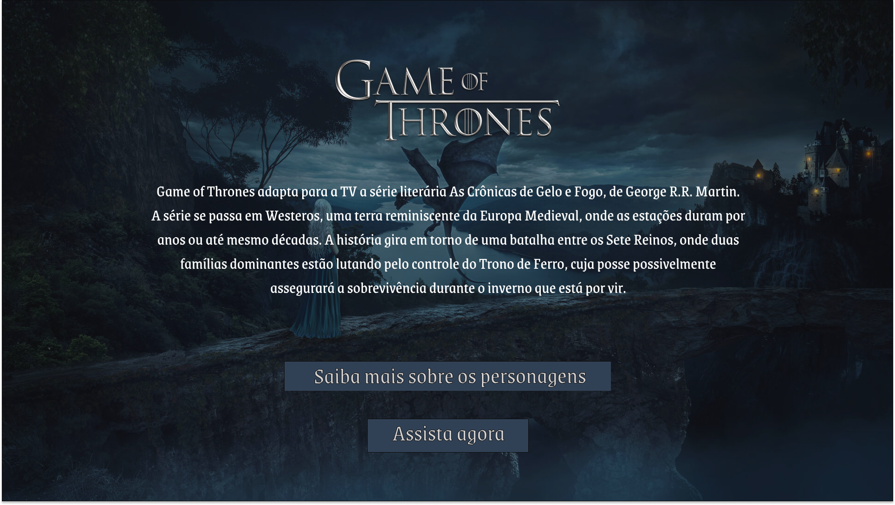

<h1 align="center"> Projeto Data Lovers - Game Of Thrones 💛 </h1>

Este é o readme do segundo projeto da Turma 10 da Laboratoria com o tema "Game of Thrones". Aqui você encontrará informações sobre o projeto, a utilização de filtros, ordenação alfabética e seletores HTML, JavaScript e CSS. 

## [Visite nosso projeto final](https://rbcribeiro.github.io/SAP010-data-lovers/)
 

## Índice

* [1. Introdução](#1-introdução-💻)
* [2. Resumo do projeto](#2-resumo-do-projeto-📄)
* [3. Histórias de usuário](#3-histórias-de-usuário-💬)
* [4. Protótipos](#4-protótipos-✒️)
* [5. Testes de usabilidade](#5-testes-de-usabilidade-❗)
* [6. Checklist dos objetivos](#6-checklist-dos-objetivos-✅)
  

## 1. Introdução 💻

Segundo a Forbes 90% dos dados que existem hoje foram gerados durante os últimos dois anos. A cada dia geramos 2.5 milhões de terabytes de dados, uma cifra sem precedentes.

Apesar disso, os dados por si só são de pouca utilidade. Para que essas grandes quantidades de dados se convertam em informação compreensível para os usuários, precisamos entender e processar estes dados. Uma forma simples de fazer isso é criando interfaces e visualizações.
  

## 2. Resumo do projeto 📄

O projeto da Turma 10 da Laboratoria tem como tema principal "Game of Thrones", uma popular série de televisão baseada nos livros de George R.R. Martin. O objetivo do projeto é desenvolver uma aplicação web relacionada ao universo de Game of Thrones, utilizando técnicas de programação para criar uma experiência interativa e envolvente para os fãs da série.

Durante o desenvolvimento do projeto, serão aplicados conceitos de filtragem, ordenação alfabética e seletores HTML, JavaScript e CSS.
  

## 3. Histórias de usuário 💬

### Busca por informações dos personagens
Como um telespectador de Game of Thrones, eu quero acessar uma página web de fácil acesso que contenha informações sobre os personagens.

### Busca por família 
Como um telespectador de Game of Thrones, eu quero ver apenas os personagens que fazem parte de determinada família.

### Busca por nome 
Como um telespectador de Game of Thrones, eu quero buscar através do nome informações sobre o personagem.

### Visualização dos personagens
Como um telespectador de Game of Thrones, eu quero visualizar as imagens dos personagens.

### Direcionamento 
Como um telespectador de Game of Thrones, eu quero encontrar na página web um direcionamento para o streaming que disponibiliza a série.
  

## 4. Protótipos ✒️

### Baixa fidelidade

    

### Alta fidelidade

    

    

    
   

 

## 5. Testes de usabilidade ❗

### Erros de digitação na busca
Após o primeiro teste, verificamos que a busca dos personagens (que eram feitas através da digitação do nome) não era viável. Com esse tipo de busca, poderiam ocorrer erros de digitação e com isso não apareceria nenhum personagem. Para a solução deste problema alteramos a busca por um seletor com todos os nomes, onde o usuário apenas precisa selecionar um nome dentre os que estão disponíveis.

### Falta de direcionamento para o streaming 
No segundo teste, foi observado que seria interessante ter na página um botão que direcionava o usuário para o streaming que contém a série. Com essa sugestão, colocamos esse botão como uma das inclusões para serem feitas ao longo do projeto.

### Falta de sinopse e de página inicial
Com a ideia de acrescentar um botão que direcionava o usuário para o streaming, também foi verificado que o site deveria ter uma sinopse sobre a série, mas que ficaria muitas informações em apenas uma página. Para resolver esse problema foi criada uma página para o início, contendo a sinopse, botão que direciona para as informações sobre os personagens e botão que direciona para o streaming.

### Falta de responsividade em telas de dispositivos móveis 
Após a página estar desenvolvida, observamos que ao visualizar em telas diferentes do desktop as imagens e os botões ficavam deslocados. Para resolver esse problema, incluimos no CSS um media query para que a página se adeque com o layout da tela.

## 6. Checklist dos objetivos ✅

[✓] Usar VanillaJS.

[✓] Passa pelo linter (npm run pretest)

[✓] Passa pelos testes (npm test)

[✓] Testes unitários cobrem um mínimo de 70% de statements, functions, lines e branches.

[✓] Inclui uma definição de produto clara e informativa no README.md.

[✓] Inclui histórias de usuário no README.md.

[✓] Inclui rascunho da solução (protótipo de baixa fidelidade) no README.md.

[✓] Inclui uma lista de problemas detectados nos testes de usabilidade no README.md

[✓] UI: Mostra lista/tabela/etc com dados e/ou indicadores.

[✓] UI: Permite ordenar dados por um ou mais campos (asc e desc).

[✓] UI: Permite filtrar dados com base em uma condição.

[✓] UI: É responsivo.

 
<h2 align="center"> Desenvolvido por:
</h2>

<h3 align="center"> Fernanda Souza

</h3>

<h3 align="center"> Renata Ribeiro 

</h3>
  
